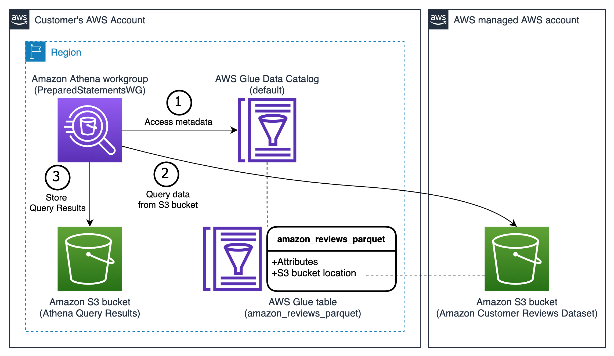

## Amazon Athena Prepared Statements and Parameterized Queries Blog

This is a repository for [Improve reusability and security using Amazon Athena parameterized queries](https://aws.amazon.com/blogs/) blog. It contains a CloudFormation template for provisioning accompanying resources and a Python command line script to list all available Athena prepared statements across AWS Regions using AWS SDK.

#### [athena-prepared-statements.yaml](athena-prepared-statements.yaml) creates the following resources:

* AWS Glue Data Catalog Database for storing metadata tables
* AWS Glue Data Catalog Table definition with Amazon.com customer reviews
* Amazon Athena Workgroup

#### [list-prepared-statements.py](list-prepared-statements.py) script requires the following:

* [AWS SDK for Python (Boto3)](https://aws.amazon.com/sdk-for-python/)
* [AWS CLI](https://docs.aws.amazon.com/cli/latest/userguide/cli-chap-getting-started.html) credentials with the following [IAM permissions](https://docs.aws.amazon.com/IAM/latest/UserGuide/access_policies.html):
    * ec2:DescribeRegions
    * athena:ListWorkGroups
    * athena:ListPreparedStatements

## Security

See [CONTRIBUTING](CONTRIBUTING.md#security-issue-notifications) for more information.

## License

This library is licensed under the MIT-0 License. See the [LICENSE](LICENSE) file.
